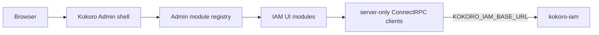

# Kokoro Admin 整体管理后台壳层技术方案

## 1. 边界

Admin 平台壳层属于 `apps/admin`。它负责品牌、全局导航、语言、当前管理员、页面布局、主题
token 和模块注册。IAM 垂直模块继续负责用户、会话、组织、成员、权限与审计页面；数据通过
现有 server-only ConnectRPC client 获取。



平台壳层不导入 IAM generated message，不接触数据库，不拥有 IAM 业务命令。IAM registry 不再
直接充当全局导航；它只作为 `AdminModuleDescriptor` 的当前 provider 输入。

## 2. 目标结构

```text
apps/admin/
  components/shell/
    admin-shell.tsx          全局浅色 ProLayout 与管理员动作
    navigation.ts            平台导航投影和图标映射
  modules/
    registry.ts              平台模块注册表和稳定描述类型
    iam/                     IAM 垂直业务模块
  i18n/
    messages.ts              中文产品与业务文案权威
    en.ts                    英文覆盖
  lib/theme.ts               Ant Design 与 ProLayout 浅色 token
  app/globals.css            壳层、页面和响应式布局
```

`AdminModuleDescriptor`：

```ts
type AdminModuleDescriptor = Readonly<{
  key: string;
  href: string;
  labelKey: MessageKey;
  groupKey: MessageKey | null;
  iconKey: "dashboard" | "users" | "sessions" | "organizations" | "access" | "audit";
  order: number;
}>;
```

registry 只接受可执行描述。新增后端能力必须先有可访问 route、权限边界和测试，再注册菜单。

## 3. 主题

使用 Ant Design 6 和 Pro Components 现有能力，不新增 UI 框架。

核心 token：

| Token | 值 | 用途 |
| --- | --- | --- |
| `canvas` | `#f4f7fb` | 页面画布 |
| `surface` | `#ffffff` | 顶栏、侧栏、工具区、表格 |
| `ink` | `#172033` | 主文字 |
| `muted` | `#65738a` | 次要文字 |
| `border` | `#dfe5ee` | 分隔和边框 |
| `primary` | `#2563d9` | 主操作和活动导航 |
| `primarySoft` | `#eaf1ff` | 活动菜单背景 |
| `success` | `#16875b` | 正常状态 |
| `warning` | `#b7791f` | 告警状态 |
| `danger` | `#c0362c` | 危险命令 |

不读取系统深色偏好，不提供暗色 token。卡片圆角最大 8px，禁止装饰性渐变球和嵌套卡片。

## 4. 布局行为

- 桌面：208px 浅色固定侧栏，56px 顶栏，主工作区最大宽度 1440px。
- 1024px：侧栏可折叠，表格在自己的 region 内滚动，页面本身不横向滚动。
- 360px：侧栏由 ProLayout breakpoint 收起；身份文本隐藏；标题与命令换行；筛选器单列。
- 顶栏产品名固定为 Kokoro 管理后台，当前 IAM 页面通过导航选中态表达，不使用“IAM 运营控制台”。

## 5. 测试

### 仓内自动化

- unit：registry 排序、无占位项、i18n 完整性、浅色 token。
- component：浅色 shell、导航分组、登录品牌、360px 工具区和命令布局。
- contract：禁止旧运营文案、禁止深色 sider token、每个 registry href 对应真实 route。
- integration/security：Auth.js、ConnectRPC、权限和业务逻辑保持原门禁。

### Codex 内置浏览器验收

1. 启动 fresh IAM、PostgreSQL、Mailpit 和 production Admin。
2. 在 Codex 内置浏览器打开登录页，逐步执行真实 Magic Link 和全部业务链路。
3. 每步保存本地/UTC 时间、页面截图、可见预期/实际结果和后端证据引用。
4. 分别验证 1440x1000、1024x768、360x800，无重叠、截断和页面横向溢出。
5. 自动化 Playwright 仅作为仓内回归工具，不再承担用户可见的浏览器窗口。

## 6. 清理策略

旧“运营控制台”文案和深色主题直接删除，不保留兼容开关、旧 token 或隐藏别名。现有 IAM
业务组件、RPC client、URL Env 配置和业务测试保持不变。
