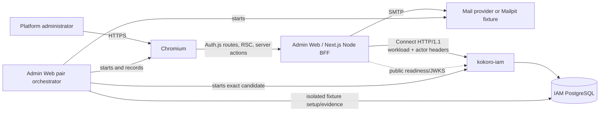

# IAM Administration Control Plane Technical Design

Status: approved for implementation planning.

PRD: `apps/admin/docs/product/PRD-001-iam-control-plane.md`

Decision: `apps/admin/docs/decisions/ADR-001-iam-rpc-control-plane.md`

## 1. Design Summary

Admin Web remains an independent Next.js browser BFF and Ant Design Pro operations console. Auth.js
owns browser authentication mechanics and delegates persistence to a complete IAM RPC Adapter. All
protected reads and commands execute on the server through generated ConnectRPC clients. IAM remains
the sole owner of identity, Session, organization, RBAC, audit, and PostgreSQL state.

The implementation is a hard replacement, not an incremental bridge. The old Prisma, Platform Admin
gateway, JWT session, dynamic manifest, and proxy-header code is removed after its reusable patterns
are ported. No runtime switch or compatibility route selects between authorities.

## 2. Current-State Audit

### 2.1 Reuse

| Asset | Decision |
|---|---|
| Next.js App Router and React 19 | Keep; reorganize public/protected route groups. |
| Auth.js and Nodemailer provider | Keep; change to database Session and complete IAM Adapter. |
| Ant Design 6, Pro Components, AntdRegistry | Keep as the sole component framework. |
| `AppShell`/`ProLayout` pattern | Keep visual structure; replace gateway-driven state/navigation. |
| Theme tokens and responsive login foundation | Keep and refine for the IAM routes. |
| `@kokoro/i18n` pure engine | Keep; replace old module dictionaries with complete IAM dictionaries. |
| Historical server-only Connect client and boundary tests | Port the pattern; replace obsolete Platform contracts and headers. |
| Security headers in `next.config.ts` | Keep, make policy testable, remove rewrites. |

### 2.2 Delete

Prisma/auth tables, `DATABASE_URL_ADMIN`, JWT callbacks, `middleware.ts`, gateway rewrites,
proxy-secret/operator headers, remote module manifests, generic resource/action APIs, old routes,
gateway-specific schemas/actions, unused Radix/shadcn primitives, and console mail delivery are
deleted. Git history is the only historical record.

### 2.3 Known baseline defect

Admin lint currently fails before reading source because `apps/admin/eslint.config.mjs` still wraps
Next's legacy config through `FlatCompat`. The repository is now on `eslint-config-next@16.2.6`,
which exports native flat arrays. `apps/user/eslint.config.mjs` proves the supported configuration.
The first implementation task replaces the stale bridge and removes `@eslint/eslintrc`.

## 3. System Context



Admin Web does not call PostgreSQL. The dashed fixture evidence path exists only inside formal pair
acceptance and is never bundled with the Next.js application.

## 4. Runtime Containers

| Container | Responsibilities | Data owned |
|---|---|---|
| Browser | Forms, navigation, accessible interactions, client-only table/dialog state | HttpOnly cookie is held by the browser but unreadable to client JavaScript. |
| Next.js BFF | Auth.js, session-cookie exchange, IAM clients, server rendering/actions, safe errors, Web logs | No business persistence. |
| Mail provider | Delivers Auth.js Magic Links | Delivery queue only. |
| IAM | Adapter persistence, access JWT, administration, organizations, RBAC, audit | All IAM data and migrations. |
| Pair orchestrator | Fresh fixtures, process supervision, Chromium and immutable evidence | Test evidence only. |

## 5. Target Source Layout

```text
apps/admin/
  app/
    api/auth/[...nextauth]/route.ts
    (public)/
      login/page.tsx
      auth/verify/page.tsx
    (control)/
      layout.tsx
      page.tsx
      users/page.tsx
      users/[userId]/page.tsx
      organizations/page.tsx
      organizations/[organizationId]/page.tsx
      sessions/page.tsx
      access/page.tsx
      audit/page.tsx
    layout.tsx
    globals.css
  components/
    shell/admin-shell.tsx
    shell/navigation.ts
    feedback/page-state.tsx
    command/command-dialog.tsx
    data/cursor-pagination.tsx
    data/status-tag.tsx
  contracts/iam/
    provider.json
    buf.yaml
    buf.lock
    buf.gen.yaml
    proto/kokoro/common/v1/error.proto
    proto/kokoro/iam/v1/*.proto
  generated/iam/**
  server/
    config/config.ts
    config/secret-file.ts
    auth/adapter.ts
    auth/cookie.ts
    auth/session.ts
    iam/transport.ts
    iam/error.ts
    iam/records.ts
    iam/auth-adapter-client.ts
    iam/session-client.ts
    iam/management-client.ts
    commands/identity.ts
    logging/logger.ts
  modules/iam/
    registry.ts
    overview/
    users/
    organizations/
    sessions/
    access/
    audit/
  i18n/
    context.tsx
    messages.ts
    en.ts
  scripts/
    contracts/import-iam.ts
    test/run-acceptance.ts
    test/run-pair-acceptance.ts
    test/evidence.ts
  test/
    catalog/p0.yaml
    unit/
    component/
    contract/
    integration/
    security/
    pair/
    support/
  reports/
    templates/
    accepted/
    pairs/iam/
```

Every non-trivial public directory gets a nearby `INDEX.md` when implementation establishes its
public exports. Generated files are committed and never manually edited.

## 6. Contract Acquisition and Generation

### 6.1 Provider snapshot

`contracts/iam/provider.json` contains repository name, candidate commit/tree, Proto SHA-256,
migration SHA-256, IAM P0 catalog SHA-256, accepted run ID, and an ordered SHA-256 entry for each
vendored Proto file. It contains no sibling absolute path.

`scripts/contracts/import-iam.ts` is an explicit maintainer command. It receives an IAM repository
path, verifies that the requested commit exists and is cleanly readable through `git show/archive`,
copies only `proto/kokoro/common/v1/error.proto` and `proto/kokoro/iam/v1/*.proto`, computes hashes,
and refuses a value that differs from the requested provider metadata. Normal install/build never
reads a sibling repository.

### 6.2 Consumer generation

- `@bufbuild/buf@1.72.0` and `@bufbuild/protoc-gen-es@2.14.0` are repository dev dependencies.
- Buf uses the committed Protovalidate dependency lock.
- `protoc-gen-es` generates TypeScript with `target=ts` and extensionless imports for Next's bundler
  resolution; no webpack extension alias or forced webpack runtime is added.
- Output is cleaned into `generated/iam/` and checked in.
- `pnpm proto:check` lints, generates, then runs `git diff --exit-code -- generated/iam`.
- Contract tests assert all five service names, all Adapter methods, every required management method,
  and the frozen provider metadata.

The generated layer is a transport contract. UI components import local domain view models and
never generated messages directly.

## 7. Auth.js Architecture

### 7.1 Configuration

One Node-only `auth.ts` composes:

- Auth.js `5.0.0-beta.31` fixed for this migration;
- Nodemailer Email provider;
- `createIamAuthAdapter()`;
- `session.strategy = "database"`;
- maximum Session age aligned with the IAM Session expiry supplied by Auth.js;
- explicit pages `/login`, `/auth/verify`, and a uniform public error route;
- an explicit session-cookie definition shared with server-only cookie extraction.

JWT callbacks and edge-safe split configuration are removed. The root public layout does not call
IAM. The `(control)` layout calls the Node `auth()` function and rejects missing/inactive/non-admin
sessions before rendering the shell.

### 7.2 Complete Adapter

`createIamAuthAdapter(client)` implements exactly:

```text
createUser             getUser                 getUserByEmail
getUserByAccount       updateUser              deleteUser
linkAccount            unlinkAccount           createSession
getSessionAndUser      updateSession            deleteSession
createVerificationToken                         useVerificationToken
```

Each method maps to the matching `IamAuthAdapterService` method, creates a request UUID, converts
timestamps through Protobuf WKT helpers, and translates optional responses to Auth.js `null`.
`createUser` remains implemented even though IAM rejects `admin-web` registration. Unknown login
callbacks therefore fail closed without a Web-side alternate User store.

Adapter output augments the Auth.js User/Session types with `id`, `platformRole`, and current status.
No provider token or opaque Session token is added to the public Auth.js Session object.

### 7.3 Enumeration-safe Magic Link flow

The login server action validates only the public email shape, calls Auth.js, and always redirects to
the same verification page for accepted request syntax. It does not pre-query IAM and branch public
copy. Auth.js creates the one-time VerificationToken through IAM and the configured SMTP provider
sends the resulting link. Existing active administrators complete callback/session creation;
unknown, suspended, and deleted identities cannot create a User or active Session.

Callback, expiry, replay, and provider errors render one public-safe state. Authorized IAM audit/log
evidence retains internal reason codes. Redirect targets are relative allowlisted paths; absolute,
scheme-relative, encoded, and cross-origin values are rejected.

### 7.4 Session cookie and actor exchange

Auth.js uses an explicitly configured opaque database-session cookie:

| Mode | Name | Required attributes |
|---|---|---|
| HTTPS/production | `__Secure-kokoro.admin.session-token` | HttpOnly, Secure, SameSite=Lax, Path=/ |
| HTTP/local pair fixture | `kokoro.admin.session-token` | HttpOnly, SameSite=Lax, Path=/ |

`server/auth/cookie.ts` is the single owner of name/options and server extraction. The opaque token is
short enough to avoid cookie chunking. Client Components never import this module or receive its
value.

For a protected read or command:

1. `(control)/layout.tsx` calls `auth()`; IAM Adapter revalidates Session and User.
2. `requireIamActor()` reads the same explicit HttpOnly cookie through Next's server `cookies()`.
3. It calls `IamSessionService/IssueAccessToken` using only the workload credential.
4. It creates business clients with the returned short-lived token in
   `X-Kokoro-User-Authorization`.
5. IAM rechecks active Session/User/platform role and method authorization.
6. The actor JWT is discarded after the server request and never cached in HTML, browser storage, or
   a client-visible Auth.js Session.

Missing cookie, null Session, expired/revoked Session, non-admin User, token-exchange failure, and IAM
`Unauthenticated` all terminate the protected flow. Logout uses Auth.js and the Adapter's
`DeleteSession`, then clears the cookie.

## 8. IAM Client Boundary

### 8.1 Transport

`server/iam/transport.ts` imports `server-only` and builds `@connectrpc/connect-node` HTTP/1.1
transports with:

- normalized `KOKORO_IAM_BASE_URL`;
- `Authorization: Bearer <admin-web credential>` on every RPC;
- optional actor JWT header for protected services;
- `X-Kokoro-Request-Id` UUID correlation;
- Connect protocol header, 15-second absolute maximum, per-method shorter defaults;
- 64 KiB request and 1 MiB response limits matching IAM;
- no automatic mutation retry.

Workload-only and actor transports are distinct typed constructors. Generated transports are never
created in browser modules.

### 8.2 Client ports

| Port | Generated services | Consumers |
|---|---|---|
| `IamAuthAdapterClient` | `IamAuthAdapterService` | Auth.js Adapter only. |
| `IamSessionClient` | `IamSessionService` | Actor exchange, Session pages, logout/revocation. |
| `IamManagementClient` | Administration, Organization, Authorization | Server Components and server actions. |

Each port returns narrow immutable domain records with JavaScript `Date`, `bigint` version, status
unions, and opaque cursor strings. Required generated fields are checked at runtime; an incomplete
provider response becomes a typed internal boundary error rather than a partial UI object.

### 8.3 Error model

`IamWebError` contains only:

```ts
type IamWebError = Readonly<{
  kind:
    | "invalid"
    | "unauthenticated"
    | "forbidden"
    | "not_found"
    | "conflict"
    | "in_progress"
    | "last_owner"
    | "precondition"
    | "unavailable"
    | "internal";
  requestId: string;
  field?: string;
}>;
```

The mapper reads `kokoro.common.v1.ErrorDetail`, allowlists reason/field, and discards upstream raw
messages. Server logs include kind, request ID, service/method, duration, command ID, and safe entity
IDs. Client-facing action results use translated i18n message keys.

Reads may retry once only for a connection failure before any response and only within the same
request deadline. Commands never retry automatically. `command_in_progress` and ambiguous transport
completion use the same command ID for an explicit user-driven recovery call.

## 9. Commands and Idempotency

Every mutation form receives a UUID `commandId` when the logical interaction begins. The Client
Component keeps it stable in a ref/hidden field across double-click, pending UI, and recovery. The
server action validates the UUID and builds:

```ts
type WebCommandInput<T> = Readonly<{
  requestId: string;
  commandId: string;
  reason: string;
  expectedVersion?: bigint;
  payload: T;
}>;
```

The action sends the same command ID and payload digest semantics through IAM `CommandContext`.
`expectedVersion` is supplied when the displayed record exposes one. After confirmed success, the
route is revalidated/refreshed and a new interaction gets a new command ID. An ambiguous result keeps
the dialog and command ID available for recovery; it never reports success from optimistic state.

## 10. Next.js Rendering and Action Flow

### 10.1 Route protection

`app/layout.tsx` provides fonts, AntdRegistry, locale, and global tokens only. Public routes live in
`(public)`. The `(control)` layout is a dynamic Node Server Component that calls `requireAdminSession`
and passes only a safe user summary to `AdminShell`.

No middleware/proxy authenticates the database Session. This avoids an edge configuration without
the IAM Adapter and ensures every protected render uses current IAM state.

### 10.2 Reads

Server page functions parse `searchParams` with strict Zod schemas, call a narrow module query, and
pass immutable view models to compact Client Component tables. Filters and cursors are URL state.
There is no `useEffect` data loading, silent `.catch(() => {})`, or unbounded fetch.

### 10.3 Mutations

Server actions validate FormData through strict schemas, resolve a fresh actor, execute one IAM
command, translate typed errors, and call `revalidatePath` only after confirmed success. Client
dialogs use `useActionState`/pending state for focus, announcements, confirmation, and recovery.

The browser never calls IAM directly and no generic `/api/*` rewrite remains. The only required route
handler is Auth.js; a future provider module adds an explicit BFF route only when its protocol cannot
use a server action or Server Component.

## 11. Module Architecture

`modules/iam/registry.ts` exports a static `AdminModuleDefinition`:

```ts
type AdminModuleDefinition = Readonly<{
  id: "iam";
  labelKey: MessageKey;
  navigation: readonly Readonly<{
    href: string;
    labelKey: MessageKey;
    icon: React.ComponentType;
  }>[];
}>;
```

The shell consumes the registry; modules do not modify the shell. A future provider module owns its
generated snapshot, server-only client, route tree, navigation entry, tests, and pair report inside
`kokoro-web`. It cannot import another provider's private module or database.

Dynamic remote manifests are not used for authentication, navigation, schemas, or arbitrary action
dispatch. Compile-time module registration keeps route ownership, code review, and browser testing
explicit.

## 12. Page-to-RPC Map

| Route | Reads | Commands |
|---|---|---|
| `/` | readiness, `ListSecurityEvents(limit=10)` | none |
| `/users` | `IamAdministrationService/ListUsers` | suspend, reactivate, delete, restore |
| `/users/[userId]` | `GetUser`, `ListSessions(user_id)`, `ListSecurityEvents(target_user_id)` | user lifecycle, revoke one/all Sessions |
| `/organizations` | `IamAdministrationService/ListOrganizations` | `IamOrganizationService/CreateOrganization` |
| `/organizations/[organizationId]` | `GetOrganization`, `ListMembers`, `ListRoleCatalog`, organization events | update/delete/restore Organization; add/change/suspend/reactivate/remove/restore Member |
| `/sessions` | `IamSessionService/ListSessions` | revoke one/all |
| `/access` | `ListPermissionCatalog`, selected Organization `ListRoleCatalog`, `Authorize` probe | none; membership role changes remain on Organization detail |
| `/audit` | `IamAdministrationService/ListSecurityEvents` | none |

The overview does not invent global totals from paginated first pages. It displays IAM readiness,
recent security activity, and direct links to filtered work queues.

## 13. Pagination, Filtering, and Versions

- Cursor values are opaque, bounded to 512 characters, and round-trip only through validated URL
  parameters.
- Page limit defaults to 25 and never exceeds IAM's 100.
- User filters: query, active/suspended/deleted, and explicit include-deleted.
- Organization filters: query, active/deleted, and explicit include-deleted.
- Audit filters match the exact Proto fields and validate UUID/time ranges before RPC.
- Back/forward navigation preserves filters. A new filter clears the cursor.
- Record versions render as copyable technical metadata and feed `expected_version` where supported.

## 14. UI and Design System

The UI remains a quiet, high-density operations console:

- Ant Design/Pro Components are the only interactive component library.
- The existing pine primary, ink navigation rail, amber warning, red destructive, and neutral work
  surfaces remain semantic tokens; the old cream-heavy presentation is reduced in data views.
- ProLayout stays fixed on desktop and uses a drawer on mobile. Navigation groups are Identity,
  Access, and Operations.
- Page headers are compact. Tables, descriptions, filters, segmented status controls, and dialogs use
  stable dimensions and no nested decorative cards.
- Ant icons identify routes/actions; text buttons remain for explicit commands.
- Destructive actions use danger styling only after a confirmation dialog with required reason.
- Loading skeletons preserve table/layout geometry. Empty, filtered-empty, forbidden, unavailable,
  and malformed states are distinct.
- Chinese and English dictionaries are complete for the final route tree; English cannot silently
  fall back to removed legacy Chinese strings.
- Focus, keyboard order, status announcements, contrast, mobile 360px layout, and reduced motion are
  component and browser acceptance gates.

## 15. Configuration and Secrets

Admin Web owns `.env.example`; real values live in its ignored `.env.local`. Parent workspace `.env`
may help the agent/operator populate the file but is not read by runtime code.

Required runtime settings:

```text
AUTH_URL
AUTH_SECRET_FILE
AUTH_SECURE_COOKIES
KOKORO_IAM_BASE_URL
KOKORO_IAM_ADMIN_WEB_TOKEN_FILE
MAGIC_LINK_MAX_AGE
EMAIL_FROM
EMAIL_SERVER_HOST
EMAIL_SERVER_PORT
```

`EMAIL_SERVER_USER` and `EMAIL_SERVER_PASSWORD_FILE` are an optional pair: both are present for an
authenticated SMTP provider and both are absent for the isolated Mailpit fixture.

`AUTH_SECRET_FILE`, IAM credential, and a configured SMTP password file are absolute normalized
regular files, owned by the runtime user/root, with exact mode `0600`. Values never appear in error
messages.
Production requires HTTPS, secure cookies, and configured SMTP. Local/test may use HTTP only when
explicitly configured and binds to loopback.

## 16. Security Controls

- Fail closed on missing/malformed configuration, IAM readiness, actor exchange, or platform role.
- Validate every untrusted URL, search param, FormData, generated response, and ErrorDetail boundary.
- Do not render raw Connect messages, secret values, provider errors, metadata JSON, or token fields.
- Parse SecurityEvent `metadata_json` as bounded JSON and display only an allowlisted safe projection;
  malformed/secret-bearing values stay hidden and produce a boundary event.
- Preserve CSP `frame-ancestors 'none'`, `base-uri 'self'`, `form-action 'self'`, X-Frame-Options,
  nosniff, Referrer-Policy, and Permissions-Policy. Add a nonce-based script policy only after Next's
  emitted script requirements are verified in production build; do not add an untested blocking CSP.
- Auth.js handles CSRF/provider callback mechanics. Custom server actions still require same-origin
  Next action handling and strict input schemas.
- Build-boundary tests scan application imports, manifest output, and source for Prisma, SQL,
  database URLs, workload credentials in Client Components, wildcard rewrites, and sibling imports.

## 17. Observability

Structured Web logs contain local/UTC timestamp, request ID, route/action, IAM service/method, result
kind, duration, command ID, and safe entity IDs. They omit email on public enumeration paths and omit
all tokens/credentials.

The BFF returns/embeds a safe request ID in operator error states. Pair acceptance correlates Web log,
IAM RPC log, Playwright step, and SQL evidence with request/command IDs. Read and command P95 are
computed separately from manifests without high-cardinality metric labels.

## 18. Test Strategy

### 18.1 Repository-owned catalog

`test/catalog/p0.yaml` is written before production implementation. It imports the ten shared IAM
pair IDs exactly once and adds Admin Web unit, component, contract, integration, security,
accessibility, responsive, build-boundary, and runtime case IDs. Each PRD requirement and acceptance
criterion maps to executable cases.

### 18.2 Categories

| Category | Environment and evidence |
|---|---|
| unit | Vitest Node; pure mapping, config, cookie, error, command, pagination, URL tests. |
| component | Vitest jsdom + Testing Library; shell, tables, filters, forms, dialogs, states, keyboard and responsive semantics. |
| contract | Provider metadata, deterministic generation, service/method inventory, Adapter completeness, forbidden imports/dependencies, i18n completeness. |
| integration | Real Next.js server, generated Connect router/listener or exact IAM listener as cataloged, Auth.js route/session/action behavior. |
| security | Enumeration, redirect, CSRF/origin, secret scan, unauthorized route, tenant, replay, malformed input, headers. |
| pair E2E | Production build/start, exact IAM candidate, fresh PostgreSQL, Mailpit, Chromium, full evidence. |

No P0 test uses `skip`, `todo`, `.only`, retry, silent catch, mocked PostgreSQL result, or a manually
constructed Magic Link callback.

### 18.3 Static and runtime gates

```text
pnpm install --frozen-lockfile
pnpm proto:check
pnpm test:unit
pnpm test:component
pnpm test:contract
pnpm test:integration
pnpm test:security
pnpm typecheck
pnpm lint --max-warnings=0
pnpm build
pnpm smoke
```

Root `kokoro-web` verification continues to run both Web apps so Admin changes cannot break the User
app. Admin acceptance additionally owns its exact categorized gates and report.

## 19. Formal Acceptance Evidence

`scripts/test/run-acceptance.ts` produces an ignored immutable directory containing command logs,
JUnit, coverage, runtime HTTP evidence, manifest, report, and SHA-256 checksums. An approved Web-only
run may be copied verbatim to `reports/accepted/<run-id>`.

`scripts/test/run-pair-acceptance.ts` supervises two rounds. Each round creates a detached IAM
worktree at the frozen candidate, fresh database, distinct credentials/secrets, isolated Mailpit,
production-built Admin Web, and fresh Chromium context. It consumes the link from Mailpit's real API.

Every Playwright business step calls an evidence helper that records case/step, expected/actual,
local/UTC start and finish, timezone offset, screenshot, trace/video/HAR references, request/command
IDs, and evidence hashes. The orchestrator records bounded provider-approved SQL state solely for
acceptance. Cleanup is exact-ID scoped and always runs; evidence is retained.

Magic Link callback capture uses a deliberate secret boundary:

1. The login-request context records its request/response trace and HAR, then stops recording.
2. The runner reads the real Mailpit message, records message/timestamp and SHA-256 digests, and keeps
   the callback URL/token only in memory.
3. A fresh ephemeral Chromium context with trace/HAR/storage-state output disabled navigates the
   exact emitted link and completes the real Auth.js callback.
4. The resulting opaque Session cookie transfers only in runner memory into the round's recording
   context; no storage-state file is written.
5. The recording context reloads the protected route and records safe screenshot, trace, video, HAR,
   Web/IAM logs, and SQL state proving Session creation. Link replay executes through another
   ephemeral non-recording navigation and records only its safe post-redirect state/evidence.
6. A secret scanner opens retained text, JSON, HAR, and trace archives and rejects raw verification,
   Session, actor, workload, Auth.js, or SMTP secrets before manifest creation.

No authentication branch or callback is mocked or omitted. Only the secret-bearing network artifact
is excluded from retained evidence.

Two round manifests and one combined pair report are required. Missing steps/artifacts, dirty
candidates, retry count above zero, skip/todo, process leaks, hash mismatch, or any failed P0 case
makes the product decision `FAIL`.

## 20. Dependency Policy

Initial implementation pins:

| Package/tool | Version |
|---|---:|
| Node.js | 22.x |
| pnpm | 11.2.2 |
| Next.js / eslint-config-next | 16.2.6 |
| React / React DOM | 19.2.4 |
| NextAuth | 5.0.0-beta.31 |
| Ant Design | 6.5.0 |
| Ant Design Pro Components | 2.8.10 |
| `@bufbuild/protobuf` / protoc-gen-es | 2.14.0 |
| Buf CLI | 1.72.0 |
| Connect packages | 2.1.2 |
| Zod | 4.4.3 |
| Nodemailer | 9.0.3 |
| TypeScript | 5.9.3 |
| Vitest / coverage | 4.1.10 |
| Playwright | 1.51.1 |

The migration does not upgrade NextAuth/Next/React/Ant Design at the same time. Caret ranges in
Admin Web are replaced by exact pins; the repository lockfile remains authoritative. Dependencies
used only by deleted Prisma/Radix/gateway code are removed.

## 21. Implementation Order

1. Repair deterministic toolchain and write the P0 catalog/report template.
2. Import/freeze/generate the IAM contract and implement boundary tests.
3. Implement strict server-only configuration, transport, error model, and domain records.
4. Implement the complete Auth.js Adapter and database-session/actor exchange.
5. Replace route protection and application shell, then delete the old authority.
6. Implement Users/Sessions, Organizations/Members/RBAC, and Audit/Overview modules in vertical
   slices with failing tests first.
7. Delete all obsolete routes/dependencies and prove the production build boundary.
8. Implement repository acceptance and run it from a clean candidate.
9. Implement pair orchestration, then execute two fresh Chromium rounds.
10. Commit the combined pair report and import its approved reference into IAM.

## 22. Failure Modes

| Failure | Required behavior |
|---|---|
| IAM unavailable/not ready | Protected route/action fails closed with request ID and unavailable state. |
| Workload credential invalid | Operator sees configuration unavailable; no credential detail. |
| Session absent/revoked/expired | Redirect to login and clear stale session through Auth.js flow. |
| User loses platform admin role | Next protected interaction becomes forbidden; no cached Web authority. |
| Magic Link replay/expiry | Uniform public callback state; no Session creation. |
| Command outcome ambiguous | Keep same command ID and offer explicit recovery; never generate another command. |
| Last-owner or version conflict | Preserve authoritative state and show typed operator guidance. |
| Generated response malformed | Boundary error, safe log, no partial render. |
| Mail unavailable | Uniform public request state plus server-side unavailable evidence; no console link. |
| Evidence artifact missing/hash mismatch | Formal acceptance fails. |

## 23. Completion Criteria

Implementation is complete only when the PRD requirements map to executable catalog cases, the old
authority and unowned routes are absent, all repository gates pass with zero warnings/skips/retries,
the Admin Web acceptance report is immutable and verified, two fresh Chromium rounds pass with full
step evidence, and IAM imports the approved pair result.
