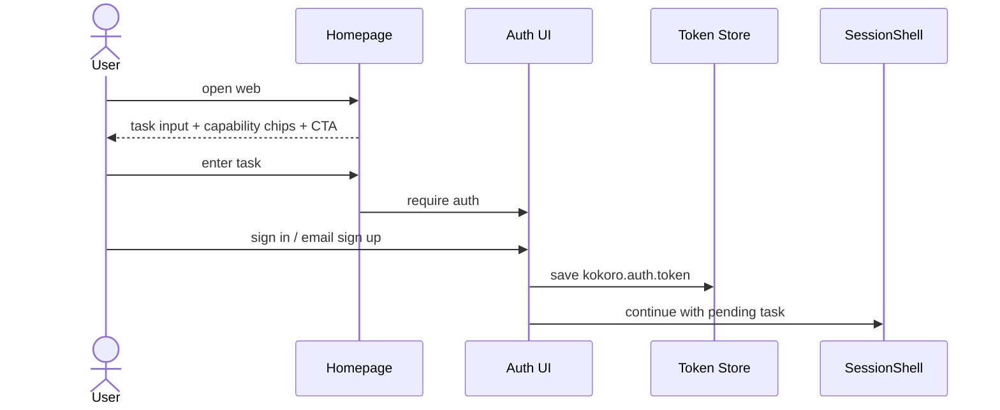
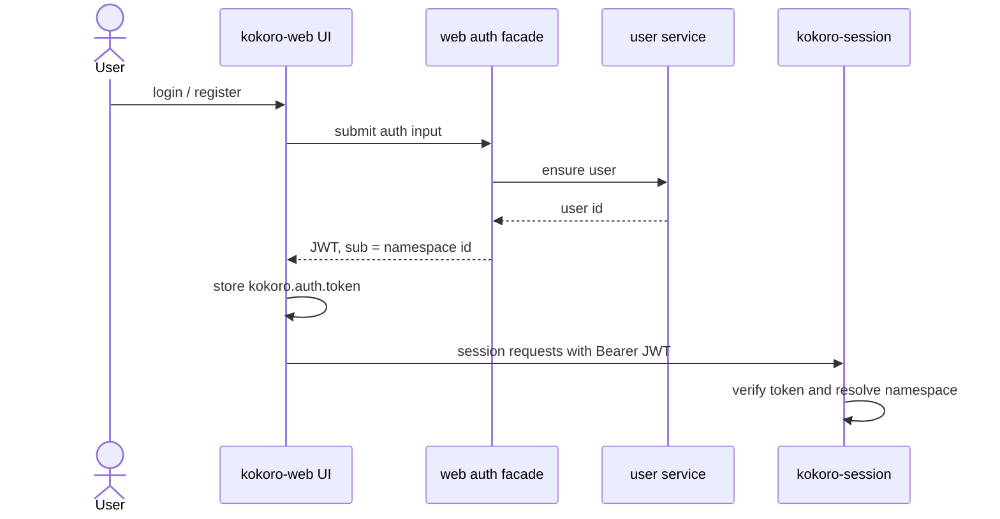
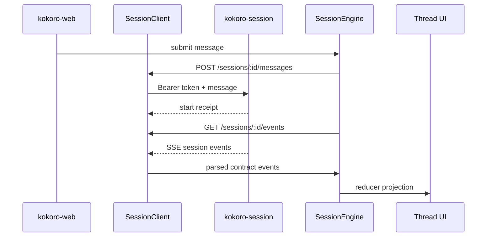
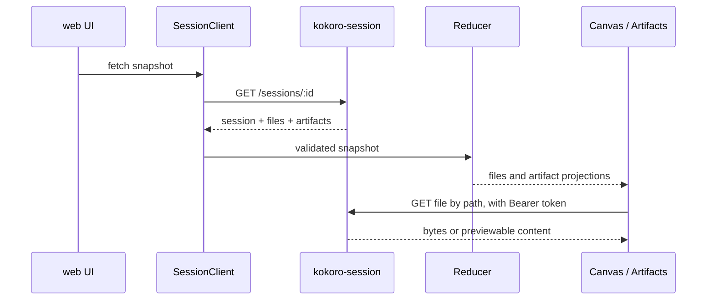

# kokoro-web 主页、auth、namespace 与 capability UI 接入方案

状态：web 子仓方案稿
日期：2026-07-07
范围：只约束 `kokoro-web`。跨仓总方案、handbook 与平台 ADR 仍以根仓文档为准。

## 1. 先固定边界

web 的职责是把用户交互、登录态和 session 连接打通，不负责发明 GA 的身份模型。

必须保持的语义：

```text
GA / agent only sees namespace.
```

在 web 侧：

- `ownerId` 可以作为 session 列表和 HTTP 权限展示语义。
- token 的 `sub` 在当前个人空间闭环中可对应 namespace。
- web 不拼 `user:<id>`、`team:<id>` 这种业务前缀。
- web 不把 `userId`、`ownerId`、`workspaceId` 当作 GA 的第二隔离轴。
- 外部 UI 参考只允许留在 `tmp/` 中间产物；正式方案和正式代码不记录来源路径、分支名、项目名、文案或代码片段。

## 2. 文档归属

```text
root docs/
  kokoro-handbook/        正式跨仓技术方案、长期规则和稳定决策
  superpowers/specs/      打磨期草案、方案对比和历史入口

kokoro-web/docs/
  README.md               web 子仓文档索引
  web/*.md                web 子仓自己的接入方案和验收清单

kokoro-web/tmp/
  ignored                 临时调研、参考材料、工作区草稿
```

web 子仓可以有 docs，但只记录 web 拥有的接口面、页面面和验收面。session、agent、platform 的主权文档不复制到这里。

## 3. 目标体验

第一阶段闭环：

```text
用户打开 web
  -> web 解析当前 site 并选择对应皮肤、文案、能力入口
  -> 看到 task-first 主页，可以直接输入任务或选择能力入口
  -> 登录或邮箱注册
  -> web 获取 session 可验的 token
  -> web 带 Bearer token 调 kokoro-session
  -> session 决定 namespace 并发起 run
  -> web 展示流式过程、文件、最终产物分区
```

web 不直接碰 Mongo、对象存储、agent checkpoint 或 capability registry。所有真实数据通过 session/http API 投影进入 UI。

## 4. Site-driven Web 产品入口层

一个 site 对应一套皮肤和产品入口。site 决定“这个站长什么样、怎么转化、露出哪些能力”，但不改变底层 GA/session 运行时。

```text
SiteContext
  -> SiteSkin
  -> SiteContent
  -> FeatureGates
  -> Homepage / Auth / App shell
```

边界：

- site 可以决定 theme、logo、文案、SEO、导航、能力入口、登录/注册入口策略。
- site 不决定 GA 的 checkpoint、memory、sandbox、workspace 隔离。
- web 消费 site config 来渲染产品面；session 仍从 token/auth 解析 namespace；GA 仍只消费 namespace。

当前 `src/app/page.tsx` 直接渲染 `SessionShell`。下一步要把产品入口层整理出来：

```text
/             public homepage
/login        sign in
/signup       email registration
/app          authenticated SessionShell
/settings     authenticated user settings
```

如果实现时暂时不新增所有路由，也要保持同样的组件边界：public home、auth surface、app shell、settings 不能揉成一个大页面。

### 4.1 首页结构

首页不是纯营销页。第一屏必须是产品入口，用户能马上把任务交给 Kokoro。

建议组件：

- `HeroTaskEntry`
  任务输入框、任务范例 chips、登录/邮箱注册/继续使用 CTA。
- `CapabilityStrip`
  Research、Slides、Code、Design、Data、Automation 等能力入口。
- `WorkflowPreview`
  prompt -> agent plan -> files/artifacts 的静态产品预览。
- `ArtifactProof`
  展示 Kokoro 会产出可预览、可下载、可标记 final 的文件。
- `TrustAndControl`
  HITL、可审阅、可取消、可恢复、文件归属。

未登录用户在首页输入的 pending task 要能暂存。登录或注册完成后，继续进入 `/app` 的会话入口。

### 4.2 可换皮契约

后续会频繁换皮，而且是按 site 换，所以要把 presentation 和功能接线拆开：

```text
site context adapter
  siteId / siteKey / locale / appKey / surface / feature flags

site skin
  color / type / radius / shadow / density / motion
  brand assets / layout preset / navigation

site content
  homepage headline / task examples / capability chips / workflow cards / SEO copy

feature adapters
  auth token / session client / canvas file fetch
```

规则：

- 先允许静态 fixture / env / host 映射，后续接 kokoro-site resolve。
- 视觉组件只吃 props，不直接调用 session API。
- auth/session/canvas adapter 放在功能层，换皮不动它。
- Feature gates 只控制入口可见性和默认 UI，不绕过 session/platform 权限。
- CSS Modules 或现有样式组织继续随组件走，不新增重型 UI 框架。
- 首页风格先走“任务输入优先 + 克制高端 AI workspace”方向，避免大段解释和过重卡片堆叠。
- 外部参考只抽象交互模式，不复制文案、路径、类名、组件结构或来源标识。

## 5. 时序图

### 5.1 首页到登录/邮箱注册



### 5.2 登录与 token 管道



web 只保存和发送 token。namespace 的最终解释权在 session，GA 只消费 session 传给它的 `context.namespace`。

### 5.3 发消息到流式渲染



所有入站数据先过 `src/contract/*` Zod schema，再进入 reducer。解析失败进入类型化错误态，不允许污染 thread。

### 5.4 文件与最终产物展示



web 只拿鉴权后的 file endpoint。文件 key、namespace 拼接和对象存储归档都不属于 web。

## 6. web 侧工作包

### WP-Web-0: 文档和边界

- 保留 `docs/README.md` 作为 web 子仓文档入口。
- 正式 web 方案放 `docs/web/`。
- 旧的本地调研树继续忽略，不进入 commit。
- README 描述当前真实 `src/` 分层，不再沿用旧 DDD 目录名。

验收：

- `git status --ignored --short docs tmp` 能看出旧草稿仍被忽略。
- `git ls-files docs` 只包含正式 web 文档。

### WP-Web-1: 主页与可换皮壳

- 增加 site context adapter：
  - 第一版可从静态 config / env / host 映射拿到 site key。
  - 后续替换为 kokoro-site resolve，不改页面组件。
- 定义 `SiteSkin`：
  - theme tokens、brand assets、layout preset、navigation。
- 定义 `SiteContent`：
  - homepage copy、task examples、capability chips、workflow cards、SEO metadata。
- 定义 `FeatureGates`：
  - 首页能力入口可见性、默认入口、waitlist/disabled 状态。
- 将 `/` 从直接 SessionShell 调整为 public homepage。
- 将 SessionShell 挪到 `/app` 或等价受保护入口。
- 新增首页 task input、任务范例 chips、能力入口、workflow preview。
- 建立 theme tokens 与 homepage content config。
- 视觉组件只通过 props/action 调用功能层，不直接拿 session engine。

验收：

- 未登录态首页有任务输入、能力入口、登录和邮箱注册 CTA。
- 已登录态有继续使用或新建任务入口。
- 未登录输入任务后，登录/注册完成可继续进入会话入口。
- 换一套 theme tokens 或 homepage content config 不需要改 auth/session/canvas 业务代码。
- 换一个 site config 可以改变皮肤、导航、能力入口和 SEO 文案。
- siteId 不进入 GA 契约，也不被当作 namespace。

### WP-Web-2: 登录/邮箱注册入口

- 新增登录与邮箱注册页面或弹层。
- email-first 表单。
- 注册覆盖 email、验证码/链接态占位、继续任务态。
- 登录覆盖 email、密码/验证码态占位、忘记/重发态占位。
- loading、error、success、disabled 状态齐全。
- web auth facade 调用户服务确认用户。
- facade 签发 session 可验 token。
- 前端统一写入 `kokoro.auth.token`，复用现有 `createSessionClient({ token })` 管道。

验收：

- 未登录时不能发起真实 session run。
- 登录后所有 session HTTP/SSE/file 请求带 Bearer token。
- 切账号后重新创建 client，旧 token 不继续污染新会话。
- 退出后 token 清空，受保护入口回登录。

### WP-Web-3: namespace 语义守护

- 前端不展示或拼装业务化 namespace。
- 不在 control body 中新增 `ownerId`、`userId`、`workspaceId`。
- 只把 auth token 交给 session，由 session 写 `run.request.context.namespace`。

验收：

- 代码搜索不存在 `user:<` 这类 namespace 拼接。
- web contract 仍只消费已有 `RuntimeContext.namespace`。

### WP-Web-4: capability 与 settings UI

- Settings 展示账号、token 状态、能力开关入口。
- Capability UI 只展示 session/platform 投影后的 enabled/available/read-only 状态。
- skill、mcp、subagent 可在同一 capability 面板下分区，不在 web 内复制 registry 逻辑。

验收：

- UI 不直接读 registry 存储。
- UI 操作调用 session/platform API，失败时显示可恢复错误。
- 外部参考材料只保留在 `tmp/`，不进入正式文档或代码。

### WP-Web-5: 最终产物分区

- thread/canvas 除普通 workspace files 外，增加 final artifacts 分区。
- 支持用户 promote/demote final artifact。
- 中间文件和最终产物视觉上分区，不改变真实归档权威。

验收：

- snapshot 同时有 files/artifacts 时 UI 不混淆。
- promote/demote 后重新拉 snapshot 可还原状态。

## 7. 验证顺序

```text
docs gate
  -> git status / git ls-files docs

static gate
  -> npm run lint
  -> npm run typecheck

behavior gate
  -> npm test
  -> npm run build
```

仅文档整理可以不跑完整 build，但进入实现阶段后，上述门禁要重新跑。
