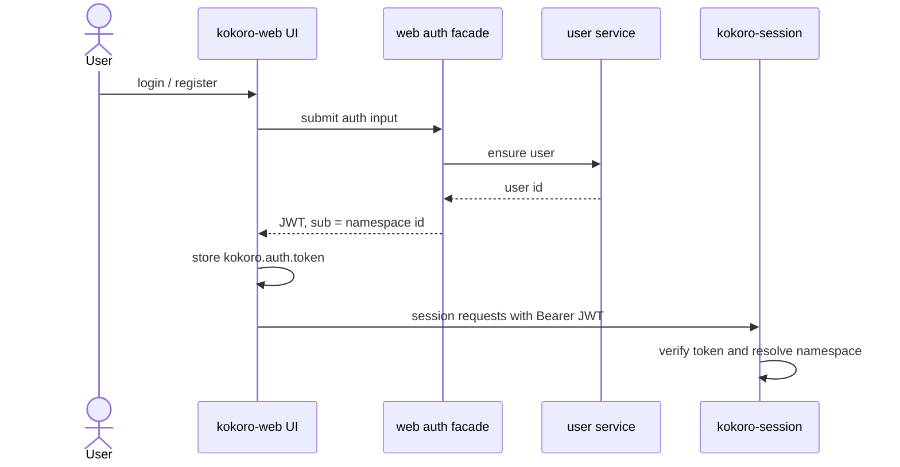
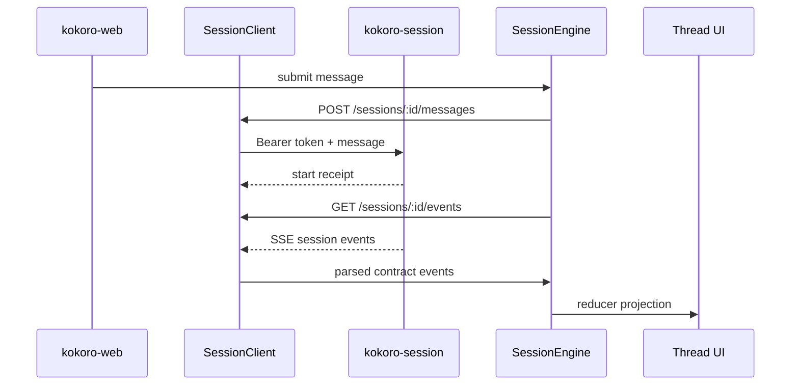
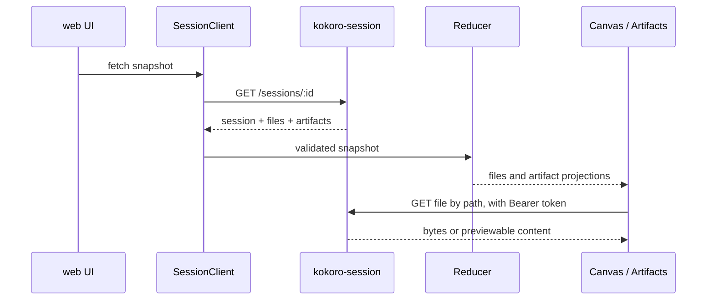

# kokoro-web namespace、auth 与 capability UI 接入方案

状态：web 子仓方案稿
日期：2026-07-07
范围：只约束 `kokoro-web`。跨仓总方案、handbook 与平台 ADR 仍以根仓文档为准。

## 1. 先固定边界

web 的职责是把用户交互、登录态和 session 连接打通，不负责发明 GA 的身份模型。

必须保持的语义：

```text
GA / agent only sees namespace.
```

在 web 侧：

- `ownerId` 可以作为 session 列表和 HTTP 权限展示语义。
- token 的 `sub` 在当前个人空间闭环中可对应 namespace。
- web 不拼 `user:<id>`、`team:<id>` 这种业务前缀。
- web 不把 `userId`、`ownerId`、`workspaceId` 当作 GA 的第二隔离轴。
- 外部 UI 参考只允许留在 `tmp/` 中间产物；正式方案和正式代码不记录来源路径、分支名、项目名、文案或代码片段。

## 2. 文档归属

```text
root docs/
  kokoro-handbook/        长期跨仓规则和稳定决策
  superpowers/specs/      跨仓方案稿和技术设计

kokoro-web/docs/
  README.md               web 子仓文档索引
  web/*.md                web 子仓自己的接入方案和验收清单

kokoro-web/tmp/
  ignored                 临时调研、参考材料、工作区草稿
```

web 子仓可以有 docs，但只记录 web 拥有的接口面、页面面和验收面。session、agent、platform 的主权文档不复制到这里。

## 3. 目标体验

第一阶段闭环：

```text
用户打开 web
  -> 登录或注册
  -> web 获取 session 可验的 token
  -> web 带 Bearer token 调 kokoro-session
  -> session 决定 namespace 并发起 run
  -> web 展示流式过程、文件、最终产物分区
```

web 不直接碰 Mongo、对象存储、agent checkpoint 或 capability registry。所有真实数据通过 session/http API 投影进入 UI。

## 4. 时序图

### 4.1 登录与 token 管道



web 只保存和发送 token。namespace 的最终解释权在 session，GA 只消费 session 传给它的 `context.namespace`。

### 4.2 发消息到流式渲染



所有入站数据先过 `src/contract/*` Zod schema，再进入 reducer。解析失败进入类型化错误态，不允许污染 thread。

### 4.3 文件与最终产物展示



web 只拿鉴权后的 file endpoint。文件 key、namespace 拼接和对象存储归档都不属于 web。

## 5. web 侧工作包

### WP-Web-0: 文档和边界

- 保留 `docs/README.md` 作为 web 子仓文档入口。
- 正式 web 方案放 `docs/web/`。
- 旧的本地调研树继续忽略，不进入 commit。
- README 描述当前真实 `src/` 分层，不再沿用旧 DDD 目录名。

验收：

- `git status --ignored --short docs tmp` 能看出旧草稿仍被忽略。
- `git ls-files docs` 只包含正式 web 文档。

### WP-Web-1: 登录/注册入口

- 新增登录/注册视图或弹层。
- web auth facade 调用户服务确认用户。
- facade 签发 session 可验 token。
- 前端统一写入 `kokoro.auth.token`，复用现有 `createSessionClient({ token })` 管道。

验收：

- 未登录时不能发起真实 session run。
- 登录后所有 session HTTP/SSE/file 请求带 Bearer token。
- 切账号后重新创建 client，旧 token 不继续污染新会话。

### WP-Web-2: namespace 语义守护

- 前端不展示或拼装业务化 namespace。
- 不在 control body 中新增 `ownerId`、`userId`、`workspaceId`。
- 只把 auth token 交给 session，由 session 写 `run.request.context.namespace`。

验收：

- 代码搜索不存在 `user:<` 这类 namespace 拼接。
- web contract 仍只消费已有 `RuntimeContext.namespace`。

### WP-Web-3: capability 与 settings UI

- Settings 展示账号、token 状态、能力开关入口。
- Capability UI 只展示 session/platform 投影后的 enabled/available/read-only 状态。
- skill、mcp、subagent 可在同一 capability 面板下分区，不在 web 内复制 registry 逻辑。

验收：

- UI 不直接读 registry 存储。
- UI 操作调用 session/platform API，失败时显示可恢复错误。
- 外部参考材料只保留在 `tmp/`，不进入正式文档或代码。

### WP-Web-4: 最终产物分区

- thread/canvas 除普通 workspace files 外，增加 final artifacts 分区。
- 支持用户 promote/demote final artifact。
- 中间文件和最终产物视觉上分区，不改变真实归档权威。

验收：

- snapshot 同时有 files/artifacts 时 UI 不混淆。
- promote/demote 后重新拉 snapshot 可还原状态。

## 6. 验证顺序

```text
docs gate
  -> git status / git ls-files docs

static gate
  -> npm run lint
  -> npm run typecheck

behavior gate
  -> npm test
  -> npm run build
```

仅文档整理可以不跑完整 build，但进入实现阶段后，上述门禁要重新跑。
